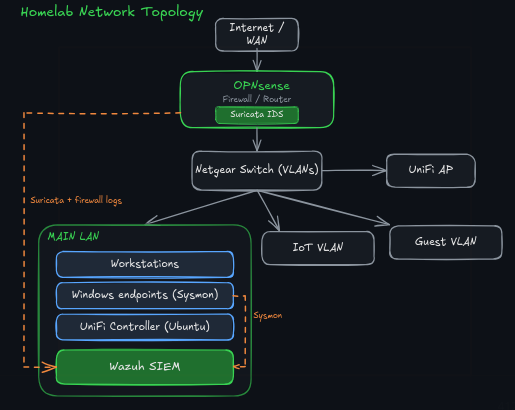

## Homelab Architecture

This is the environment everything else in my portfolio runs on. I built it to mirror the patterns I see in real enterprise networks: segmentation, a proper firewall, an IDS, and centralised logging, so I could practice detection and investigation on infrastructure I understand end to end. The goal was to make deliberate design choices and be able to explain every one of them, and to build a base I can keep extending as my projects grow.

### Topology

At a high level, an appliance running OPNsense sits at the edge as the firewall and router, a Netgear managed switch handles VLAN tagging, and a UniFi access point provides wireless, managed from a UniFi controller I self-host on an Ubuntu server.

### Why segmentation

The whole network is carved into VLANs rather than sitting on one flat LAN, and that was the first decision I made. A flat network means anything that gets onto it can reach everything else. Segmenting by trust level gives me real boundaries to enforce at the firewall, and it gives me meaningful traffic to watch: when something on a low-trust segment tries to reach a high-trust one, that's a signal worth alerting on.

The segments break down roughly as:

- **Main LAN** for trusted devices and my workstations.
- **Guest** for visitor devices, isolated from everything internal.
- **IoT** for smart-home gear, which I treat as untrusted by default.

I created rules on the OPNsense firewall to deny inter-VLAN traffic, and I only open the specific paths each segment genuinely needs.

### Core network services

OPNsense handles DHCP and DNS across the VLANs, with Unbound as the resolver. I have it forward queries over DNS over TLS to Quad9, so lookups are encrypted in transit and filtered against known-malicious domains by default. It's a small bit of config for a worthwhile gain in privacy and security.

### Why OPNsense

The router my ISP gave me was excellent for ease of use and reliability but not suitable for a home lab. I wanted a firewall and router I could actually configure and inspect rather than one that limits what you can do and hides everything behind a friendly UI. So getting rid of my ISP router was one of the first actions I took for my home lab project. OPNsense gives me granular rules, proper logging, and the freedom to shape the network exactly how I want. Running it on a dedicated appliance keeps it isolated and means the firewall isn't sharing resources with anything I'm experimenting on.

### Suricata (IDS)

Suricata runs on OPNsense and inspects traffic as it crosses the firewall. Rather than letting those alerts sit in a separate console, I forward Suricata's eve.json into Wazuh so network detections land in the same place as my endpoint detections. That single-pane approach is deliberate: it's how a real SOC works, correlating host and network signals together instead of swivel-chairing between tools.

### Centralised logging

I identified what generates logs and set up forwarding to send them to Wazuh: the Windows endpoints via Sysmon, OPNsense and Suricata from the edge, and the firewall itself. Centralising the logs is what turns a pile of separate devices into something I can monitor and investigate as one environment. There are certainly more types of logs I could forward to Wazuh, such as UniFi controller logs, but those will require configuring a decoder so Wazuh can parse and understand them. Part of my ongoing project is to identify which logs are relevant and forward them.

### What's next

Some of what's planned or in progress:

**Detection and monitoring**
- VirusTotal API enrichment, so file hashes and IOCs in Wazuh alerts get automatically checked against threat intel during triage.
- File integrity monitoring (FIM) on the Windows endpoints to catch unauthorised changes to key files and directories.
- Brute-force attack simulation with active response: generate the attack, detect it in Wazuh, and have the system respond automatically.
- Contribute a detection rule to the public Sigma repo, an open-source rule for a real technique, reviewed and merged by maintainers.

**Adversary simulation and analysis**
- Active Directory attack-and-defend lab: stand up a small AD, run techniques like Kerberoasting, then detect and defend against them. Showing both the attack and the detection is the purple-team angle.
- Network forensics: hunt for C2 beaconing in malicious pcaps with Wireshark/Zeek and document the indicators.
- A honeypot on an isolated segment to capture real-world attack traffic and generate genuine alerts to investigate.

**Automation**
- SOAR-style response automation in Python: auto-enrich an alert, auto-contain a host or account, auto-open a ticket, tied into the Wazuh pipeline.

**Infrastructure**
- Proxmox to run multiple VMs on one box, so I can spin up isolated targets and attacker machines without new hardware.
- A dedicated sandbox segment for safely detonating suspicious samples, fully isolated from the rest of the network.
- Pi-hole for network-wide ad and tracker blocking, alongside the existing Quad9 malicious-domain filtering.
