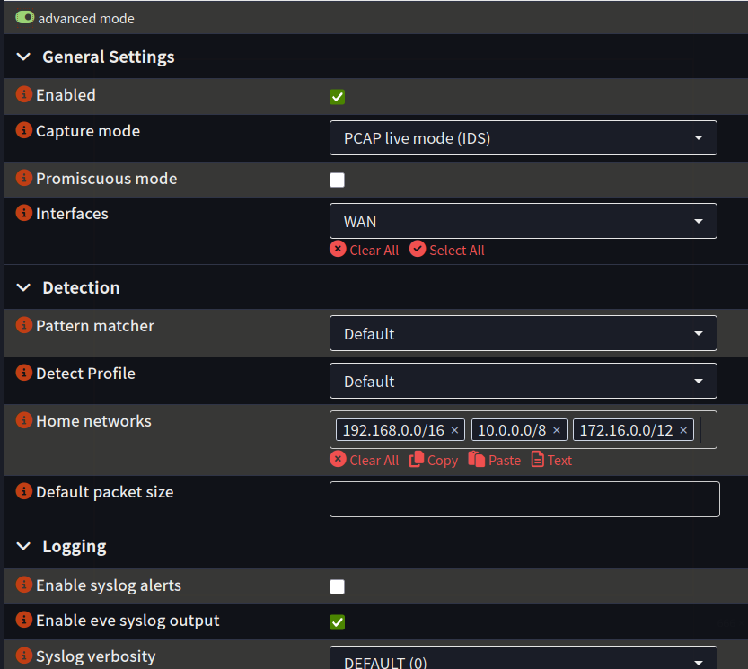
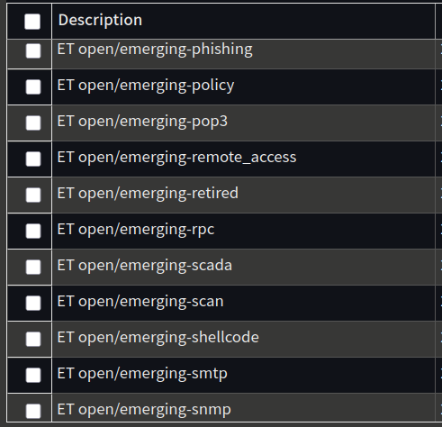
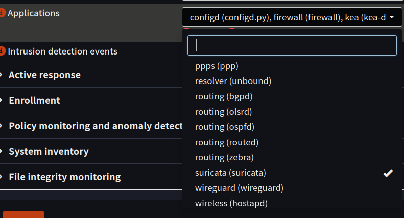
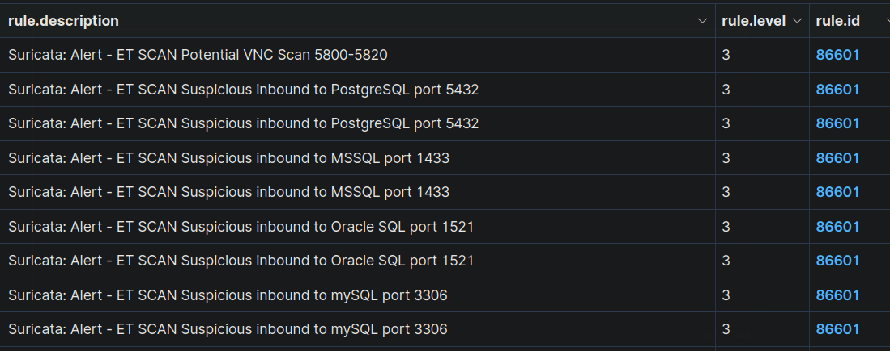
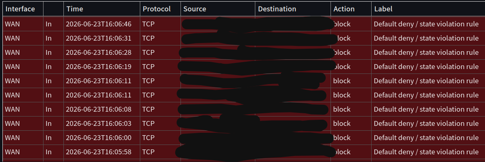

# Suricata (IDS)

Suricata is an open-source intrusion detection system. It inspects network traffic in real time and matches it against rulesets that describe known-malicious or suspicious behaviour, raising an alert whenever traffic matches. In this lab it runs on OPNsense, and its alerts are forwarded into Wazuh so network detections sit alongside my endpoint detections in one place.

## Setup

Setting up Suricata on OPNsense is pretty straightforward.

Go to Services -> Intrusion Detection -> Administration and enable it. The important detail is turning on EVE syslog output, because that produces the eve.json log the Wazuh agent reads. Without it, Suricata would still alert locally but nothing would reach Wazuh.

Next, download the rulesets. Without rules there are no alerts, since Suricata needs known patterns to match against. I used the ET Open (Emerging Threats) ruleset and enabled the categories I wanted coverage for.

The last step is making sure the logs actually reach Wazuh. In the Wazuh agent settings on OPNsense, I added Suricata as an application source so the agent picks up its eve.json output.

## Troubleshooting the pipeline

I originally tried forwarding logs over syslog instead of using the Wazuh agent, but it didn't work the way I wanted. Logs were clearly arriving (tcpdump showed a steady stream from OPNsense), but Suricata alerts appeared in the dashboard as a generic "Unknown problem somewhere on the system" with none of the useful fields.

I worked through it in layers. Enabling logall temporarily, which writes every received event to archives.log regardless of whether a rule matched, confirmed the events were arriving and being ingested. So the problem wasn't the network or firewall, it was decoding: over syslog, eve.json arrives wrapped in a syslog envelope, and the default decoder wasn't parsing the JSON inside.

The fix was to switch to the Wazuh agent, which reads eve.json natively so Wazuh's decoders parse it cleanly. Alerts now arrive fully decoded with signature, source, destination, and severity. A lot of guides online suggest forwarding logs from OPNsense to Wazuh over syslog rather than using the agent, but that didn't work cleanly for me, and making it work would have meant writing custom decoders and rules. That's a lot of effort for something the agent already handles out of the box.

**The takeaway: "logs arriving" and "logs decoded into usable alerts" are two different things, and telling them apart is what made this solvable.**

## Testing it works

I ran an nmap scan against an internal host from inside the LAN. The alerts came through fully decoded, with the ET SCAN signature, source, and destination populated.

I then scanned from an external device on mobile data, and two things happened that show the firewall and IDS doing different jobs. Traffic to a closed port was dropped at the edge by default-deny and logged as a firewall block. Traffic to an allowed path was inspected by Suricata and raised an IDS alert. So blunt external scanning gets recorded by the firewall, while permitted traffic gets inspected by the IDS.

This matches OPNsense's documentation: an IDS on the WAN behind NAT only sees traffic after translation, and the firewall handles the unsolicited noise. The IDS earns its place inspecting allowed traffic, where it sees real source addresses and matches rules properly. That's why adding an internal-interface sensor is on my list: it would show traffic between VLANs, like something on the IoT segment reaching for my trusted devices, which an edge sensor never sees. That east-west visibility is where I'd catch an attacker moving inside the network, not just one probing the perimeter.

[OPNsense IPS documentation](https://docs.opnsense.org/manual/ips.html)

## What's next

- Run a wider range of tests and simulated attacks, and trace each one through to its alert in Wazuh to get comfortable with the investigation flow.
- Add a sensor on an internal interface to get visibility of inter-VLAN traffic, not just the edge.
- Enable and evaluate more rule categories, then tune out the false positives so the signal stays useful.
- Map the alerts I care about to MITRE ATT&CK techniques, so the detections tie back to a framework rather than sitting as isolated rules.
