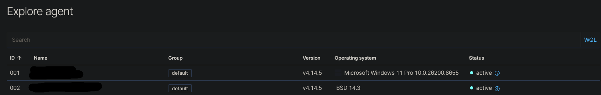
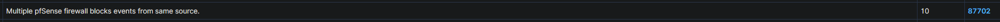
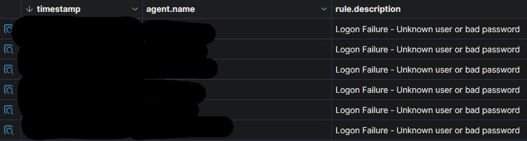

# Wazuh (SIEM)

I built a SIEM pipeline from scratch and proved it end to end: an nmap scan I launched from a Kali box travelled through the firewall, across syslog, and landed as a correlated alert in the dashboard. Wazuh, an open-source SIEM, is the centre of this lab. It's the single place I watch the environment from, pulling host and network signals together so I can practise the actual work of a SOC: generate activity, triage what comes back, and tell real signals from noise. 

**What it pulls together:**

- Windows endpoints via the Wazuh agent and Sysmon (SwiftOnSecurity config) for process-level telemetry
- OPNsense firewall logs over syslog for network visibility
- Suricata IDS on OPNsense for network detections ([separate writeup](suricata.html))

## How I built it

1. **Wazuh server:** deployed all-in-one (indexer, manager, dashboard) on an Ubuntu server. One box to manage, with a static reservation on OPNsense so its address never moves.
2. **Windows endpoint:** installed the Wazuh agent and pointed it at the manager.
3. **Process telemetry:** added Sysmon with the SwiftOnSecurity config, so I get process creation, full command lines, and parent-and-child relationships instead of thin default logs.
4. **Firewall logs:** forwarded OPNsense logs over syslog.
5. **IDS:** added Suricata on OPNsense.


*Both the Windows endpoint and OPNsense onboarded and reporting in.*

## Proving it end to end
 
Standing a SIEM up is one thing; knowing it catches something is another. So I built a controlled test to watch a detection travel the whole pipeline:
 
- Put a Kali VM on its own VLAN.
- Wrote an OPNsense rule blocking traffic between that VLAN and the main LAN, forcing the scan through the firewall where it gets logged and forwarded.
- Ran nmap scans from Kali against the main LAN.
- Confirmed the syslog was reaching the Wazuh box with tcpdump before expecting anything in the dashboard.

It landed as **"Multiple firewall block events from same source"**, with Wazuh correlating the individual blocks into one alert, a detection I'd map to MITRE ATT&CK **T1046 (Network Service Discovery)**. Seeing a scan I'd generated get caught and correlated through a pipeline I'd built from scratch was the moment it clicked.



I performed two more tests:

- **Failed logins:** I deliberately mistyped the password on a local Windows account several times, and the repeated failures surfaced in Wazuh. It's the same pattern that, against a real account, points to a brute-force attempt.
- **PowerShell:** Sysmon's full command-line logging (from the SwiftOnSecurity config) caught the PowerShell I'd run to SSH into the servers for actual admin work. Those alerts fired, but they were benign: my own activity, not an attacker.

## Failed logins

To see this end to end, I traced the failed logins from the Windows host through to Wazuh. On the endpoint, each failure lands in the Windows Event Viewer under Security event ID 4625 (an account that failed to log on). This PowerShell lists those events in a table:

```powershell
Get-WinEvent -FilterHashtable @{LogName = 'Security'; Id = 4625}
```
The same events then surface as alerts in Wazuh, matched on event ID 4625.




## What's next
 
- Triage a wider range of activity and trace each event through to its alert.
- Tune out false positives so the alerts that fire are worth looking at.
- Map more of the detections I care about to MITRE ATT&CK.
- Add VirusTotal enrichment so hashes and IOCs get checked against threat intel during triage.
- File integrity monitoring on the Windows endpoints.